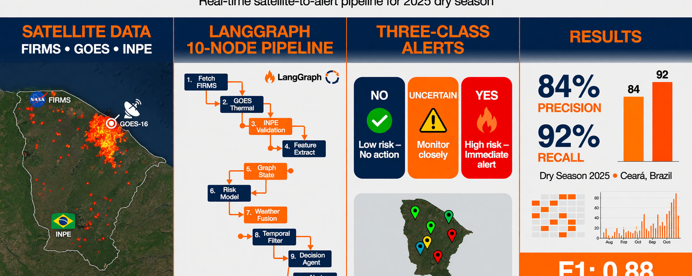

# 🔥 Ceará Digital Twin — Wildfires

> Intelligent wildfire monitoring platform for the State of Ceará, Brazil — agentic AI, near real-time satellite data, and an interactive web interface.

**Live demo (AWS):** http://98.91.177.145

## What is it? (plain-language overview)

Imagine a **live map of Ceará** showing where fires or fire risk are happening, almost in real time.

The system combines **satellite** data (INPE, NASA, and GOES-16) with **weather** data (rain, wind, humidity) and presents everything on an **interactive web map**. Managers, civil defense teams, and researchers can quickly see what is happening across the state.

The key difference is **artificial intelligence**: instead of only plotting points on a map, AI agents **analyze**, **cross-check sources**, **explain risk**, and **generate alerts with justification** — for example, why a municipality is critical today.

**At a glance:**

| Question | Answer |
|---|---|
| What is it for? | Monitor and explain wildfires in Ceará |
| Where does data come from? | Satellites (INPE, NASA, GOES-16) and weather stations |
| Who can use it? | Civil defense, environmental managers, researchers |
| What does the AI do? | Validates hotspots, calculates risk, answers questions, generates bulletins |
| Is it open source? | Yes — install, study, and adapt |

**Simple flow:**

```
Satellites + weather  →  System collects & organizes  →  AI analyzes & explains  →  Web map & alerts
```

Related scientific article: submission to *Environmental Modelling & Software* (open code and data in this repository).

---

[](https://python.org)
[](https://fastapi.tiangolo.com)
[](https://langchain.com)
[](https://langchain-ai.github.io/langgraph)
[](https://react.dev)
[](https://postgis.net)
[](LICENSE)
[](https://pytorch.org)
[](https://arxiv.org/abs/2305.18861)
[](https://arxiv.org/abs/2106.09494)
[](https://arxiv.org/abs/2604.05018)

---

## 📋 Table of Contents

- [What is it?](#what-is-it-plain-language-overview)
- [Graphical Abstract](#graphical-abstract)
- [Overview](#-overview)
- [Architecture](#-architecture)
- [Data Sources](#-data-sources)
- [Tech Stack](#-tech-stack)
- [Project Structure](#-project-structure)
- [Prerequisites](#-prerequisites)
- [Installation & Run](#-installation--run)
- [AWS Deployment](#-aws-deployment)
- [API Reference](#-api-reference)
- [AI Agents](#-ai-agents)
- [LangGraph Pipeline](#-langgraph-pipeline)
- [React Interface](#-react-interface)
- [Environment Variables](#-environment-variables)
- [Contributing](#-contributing)

---

## Graphical Abstract



Satellite ingestion (NASA FIRMS, GOES-16, INPE), LangGraph orchestration, three-class alerting (NO / UNCERTAIN / YES), and dry-season 2025 validation metrics for Ceará, Brazil.

---

## 🌐 Overview

The **Ceará Digital Twin for Wildfires** is an operational platform that detects, monitors, validates, prioritizes, and alerts on wildfires across the State of Ceará in near real time.

The system acts as a **digital twin of Ceará's territory**, enabling:

| Capability | Description |
|---|---|
| 🔥 Active hotspots | Detection via INPE, NASA FIRMS, and GOES-16 |
| 🌡️ Climate risk | Index computed with FUNCEME and INMET |
| 📡 GOES-16 | Persistence, FRP, and temporal evolution of hotspots |
| 🗺️ Spatial cross-check | Municipalities, protected areas, urban zones via PostGIS |
| 🤖 Agentic AI | ReAct agents with LangChain + LangGraph |
| 🚨 Explainable alerts | With technical justification and audit trail |
| 💬 Smart chat | Natural-language questions |

---

## 🏗️ Architecture

```
┌─────────────────────────────────────────────────────────────────┐
│                        DATA SOURCES                             │
│  INPE │ NASA FIRMS │ GOES-16 │ FUNCEME │ INMET │ MapBiomas      │
└───────────────────────────┬─────────────────────────────────────┘
                            │
                            ▼
              ┌─────────────────────────┐
              │   ETL / Periodic Collection │
              │   (Celery + Redis)       │
              └────────────┬────────────┘
                           │
                           ▼
              ┌─────────────────────────┐
              │  Pydantic Validation     │
              └────────────┬────────────┘
                           │
                           ▼
         ┌─────────────────────────────────┐
         │   PostgreSQL + PostGIS           │
         │   (hotspots, events, weather)    │
         └────────────────┬────────────────┘
                          │
                          ▼
              ┌───────────────────────┐
              │  LangGraph Orchestrator│
              └──────────┬────────────┘
                         │
        ┌────────────────┼────────────────┐
        ▼                ▼                ▼
  [Geo Agent]    [GOES-16 Agent]   [Climate Agent]
        │                │                │
        └────────────────┼────────────────┘
                         │
                         ▼
            ┌────────────────────────┐
            │  ReAct Diagnostic Agent │
            │  (LangChain + OpenAI)   │
            └────────────┬───────────┘
                         │
              ┌──────────┴──────────┐
              ▼                     ▼
        [Alerts]            [Technical Bulletin]
              │                     │
              └──────────┬──────────┘
                         ▼
              ┌─────────────────────┐
              │   FastAPI API        │
              │   + React Frontend   │
              └─────────────────────┘
```

---

## 📡 Data Sources

| Source | Use | Frequency |
|---|---|---|
| **INPE BDQueimadas** | Official hotspots in Brazil | Every 15 min |
| **NASA FIRMS** (MODIS/VIIRS) | Cross-validation | Every 15 min |
| **GOES-16** (NOAA S3) | Near real-time detection, FRP, persistence | Every 15 min |
| **MapBiomas Fire** | Burned-area history and recurrence | Daily |
| **MapBiomas Land Cover** | Vegetation type and vulnerability | Monthly |
| **FUNCEME** | Rain, drought, Ceará climate | Hourly |
| **INMET** | Temperature, humidity, wind | Hourly |
| **CPTEC/INPE** | Weather forecast | Daily |
| **IPECE** | Territorial layers for Ceará | Static |
| **IBGE** | Municipal boundaries | Static |

---

## 🛠️ Tech Stack

### Backend
| Technology | Version | Role |
|---|---|---|
| **Python** | 3.12 | Main language |
| **FastAPI** | 0.115 | Async REST API |
| **LangChain** | 0.3 | Specialized tool-using agents |
| **LangGraph** | 0.2 | Agent pipeline orchestration |
| **Pydantic** | 2.10 | Data validation |
| **SQLAlchemy** | 2.0 | Async ORM |
| **PostgreSQL + PostGIS** | 16 + 3.4 | Geospatial database |
| **Celery + Redis** | 5.4 | Periodic collection and queues |
| **boto3** | 1.35 | GOES-16 access via AWS S3 |
| **netCDF4 + numpy** | — | GOES-16 data processing |

### Frontend
| Technology | Version | Role |
|---|---|---|
| **React** | 18 | Web UI |
| **TypeScript** | 5.7 | Static typing |
| **Vite** | 6 | Build and dev server |
| **react-map-gl + MapLibre** | 7 + 4 | Interactive map |
| **deck.gl** | 9 | Advanced geospatial visuals |
| **Recharts** | 2.13 | Charts and timeline |
| **Zustand** | 5 | State management |
| **Tailwind CSS** | 3.4 | Styling |

---

## 📁 Project Structure

```
ceara-queimadas/
├── backend/
│   ├── app/
│   │   ├── agents/          # LangChain + LangGraph agents
│   │   ├── api/             # FastAPI routes
│   │   ├── core/            # Config, database, ORM
│   │   ├── models/          # Pydantic schemas
│   │   ├── services/        # INPE, FIRMS, GOES-16, climate, geo
│   │   └── tools/           # LangChain tools
│   ├── migrations/
│   └── requirements.txt
├── frontend/
│   ├── src/
│   │   ├── components/      # Map, chat, alerts, dashboards
│   │   ├── pages/           # Dashboard, Real Map, Alerts, Chat, etc.
│   │   └── services/        # API client
│   └── package.json
├── deploy/                  # AWS EC2 scripts
├── docker/
│   └── docker-compose.yml
└── README.md
```

---

## ✅ Prerequisites

- **Docker** 24+ and **Docker Compose** v2
- **Python** 3.12+ (local backend development)
- **Node.js** 20+ (local frontend development)
- **OpenAI API key** (for LangChain agents)
- **NASA FIRMS API key** (free at [firms.modaps.eosdis.nasa.gov](https://firms.modaps.eosdis.nasa.gov/api/area/))

---

## 🚀 Installation & Run

### 1. Clone the repository

```bash
git clone https://github.com/naubergois/ceara-queimadas.git
cd ceara-queimadas
```

### 2. Configure environment variables

```bash
cp backend/.env.example backend/.env
# Edit backend/.env with your API keys
```

Required variables:
```env
OPENAI_API_KEY=sk-...
NASA_FIRMS_API_KEY=your-key
```

### 3. Run with Docker Compose

```bash
cd docker
docker compose up -d
```

| Service | URL |
|---|---|
| React frontend | http://localhost:5173 |
| FastAPI | http://localhost:8000 |
| Swagger UI | http://localhost:8000/docs |
| PostgreSQL | localhost:5432 |
| Redis | localhost:6379 |

### 4. Local development (without Docker)

**Backend:**
```bash
cd backend
python -m venv .venv
source .venv/bin/activate
pip install -r requirements.txt
uvicorn app.main:app --reload
```

**Frontend:**
```bash
cd frontend
npm install
npm run dev
```

---

## ☁️ AWS Deployment

The production instance runs on **Amazon Linux 2023** (EC2) with Nginx + systemd.

**Live app:** http://98.91.177.145  
**API docs:** http://98.91.177.145/docs  
**Health check:** http://98.91.177.145/health

### Option 1: Automatic (user-data)

Launch an Amazon Linux 2023 instance and paste `deploy/user-data.sh` into the **User data** field. The script installs dependencies, clones the repo, builds the frontend, configures Nginx, and registers the backend as a systemd service.

### Option 2: Manual on an existing EC2

```bash
sudo bash deploy/finish-deploy.sh
```

### Post-deploy verification

```bash
curl http://YOUR_IP/health
sudo systemctl status unifor-backend nginx
sudo journalctl -u unifor-backend -f --no-pager
```

---

## 📡 API Reference

| Method | Endpoint | Description |
|---|---|---|
| `GET` | `/api/v1/focos/tempo-real` | Recent hotspots (filter by hours and source) |
| `GET` | `/api/v1/focos/municipio/{nome}` | Hotspots by municipality |
| `GET` | `/api/v1/risco/municipios` | Municipal risk ranking |
| `GET` | `/api/v1/alertas/ativos` | Active alerts |
| `GET` | `/api/v1/goes16/eventos` | GOES-16 events |
| `POST` | `/api/v1/agente/pergunta` | Chat with ReAct agent |
| `GET` | `/api/v1/relatorios/boletim` | Generate technical bulletin |
| `GET` | `/api/v1/eventos/{id}` | Event detail |
| `GET` | `/api/v1/mapa/camadas` | Available map layers |
| `GET` | `/health` | Health check |

**Example — ask the agent:**
```bash
curl -X POST http://localhost:8000/api/v1/agente/pergunta \
  -H "Content-Type: application/json" \
  -d '{"pergunta": "Which municipalities in Ceará have critical risk today?"}'
```

---

## 🤖 AI Agents

### LangChain agents

| Agent | Responsibility |
|---|---|
| **Collector** | Queries INPE, NASA FIRMS, GOES-16, FUNCEME, INMET |
| **Geospatial** | Cross-checks hotspots with municipalities, protected areas, land use (PostGIS) |
| **Climate** | Computes risk from rain, wind, humidity, temperature |
| **GOES-16** | Analyzes persistence, FRP, temperature, hotspot evolution |
| **Validator** | Checks data consistency with Pydantic |
| **ReAct Diagnostic** | Reasons about cause, risk, and priority (ReAct pattern) |
| **Alert** | Generates messages for managers and operations teams |
| **Reporter** | Produces technical bulletins and executive summaries |
| **Auditor** | Verifies alerts have sufficient evidence (anti-false-positive) |

### LangChain tools

```python
buscar_focos_recentes       # Hotspots by municipality, time window, source
buscar_dados_climaticos     # Temperature, humidity, wind, days without rain
buscar_risco_municipal      # Risk index by municipality
buscar_dados_goes16         # GOES-16 readings with FRP and persistence
buscar_historico_mapbiomas  # Fire history by municipality
listar_municipios_criticos  # Ranking of most critical municipalities
```

---

## 🔄 LangGraph Pipeline

```
START → collect_data → validate_data → [geo | goes16 | climate agents]
  → merge_evidence → classify_risk → react_diagnostic → generate_alerts
  → generate_bulletin → END
```

---

## 🖥️ React Interface

| Page | Route | Description |
|---|---|---|
| **Dashboard** | `/` | KPIs, timeline, risk ranking, alerts |
| **Real Map** | `/mapa-real` | Live NASA FIRMS hotspots + AI explanations |
| **Map** | `/mapa` | Interactive map with layers |
| **Alerts** | `/alertas` | Full alert list with level filters |
| **AI Chat** | `/chat` | Conversational ReAct agent |
| **Bulletin** | `/boletim` | Technical report generation |
| **AI Prediction** | `/inovacao` | NeKo-PIGNN risk forecasting |
| **Upload** | `/upload` | Satellite data inference |

---

## ⚙️ Environment Variables

| Variable | Required | Description |
|---|---|---|
| `OPENAI_API_KEY` | ✅ | OpenAI key for LangChain agents |
| `NASA_FIRMS_API_KEY` | ✅ | NASA FIRMS key (free) |
| `DATABASE_URL` | ✅ | PostgreSQL+PostGIS URL |
| `REDIS_URL` | ✅ | Redis URL |
| `OPENAI_MODEL` | — | OpenAI model (default: `gpt-4o`) |
| `DEEPSEEK_API_KEY` | — | DeepSeek key (alternative LLM) |
| `DEBUG` | — | Debug mode (default: `false`) |

---

## 🔍 Traceability & Audit

Each alert records data source, collection time, responsible agent, tools used, evidence, confidence level, natural-language justification, and false-positive flags. The **Auditor Agent** checks whether alerts are justified and whether GOES-16, INPE, and NASA FIRMS agree.

---

## 🤝 Contributing

1. Fork the repository
2. Create a branch: `git checkout -b feature/my-feature`
3. Commit: `git commit -m 'feat: add my feature'`
4. Push: `git push origin feature/my-feature`
5. Open a Pull Request

---

## 📄 License

MIT © 2025 — Built for public wildfire monitoring in the State of Ceará, Brazil.

---

## 🙏 Acknowledgments

- [INPE BDQueimadas](https://queimadas.dgi.inpe.br) — official hotspot data
- [NASA FIRMS](https://firms.modaps.eosdis.nasa.gov) — MODIS and VIIRS
- [NOAA GOES-16](https://www.goes.noaa.gov) — near real-time imagery
- [FUNCEME](https://www.funceme.br) — Ceará climate data
- [MapBiomas](https://mapbiomas.org) — land cover history
- [LangChain](https://langchain.com) and [LangGraph](https://langchain-ai.github.io/langgraph) — agent framework

## 📚 Additional Documentation

| Document | Description |
|-----------|-----------|
| [Installation Guide](docs/GUIA_DE_INSTALACAO.md) | Setup from scratch (Docker, manual, AWS) |
| [Changelog](docs/CHANGELOG.md) | Version history |
| [Research Documentation](docs/DOCUMENTACAO_PESQUISA_E_TESTES.md) | Experiments and results |
