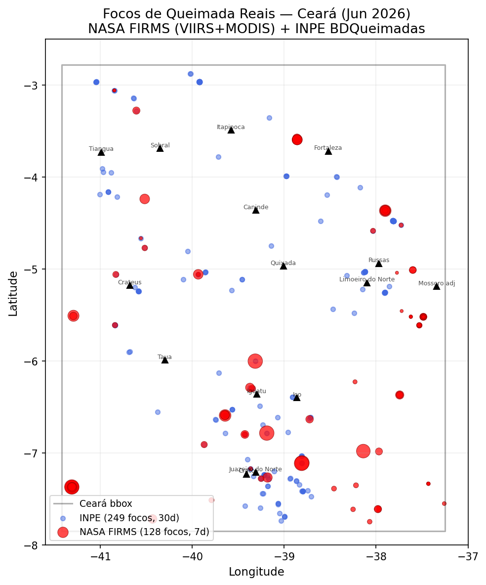
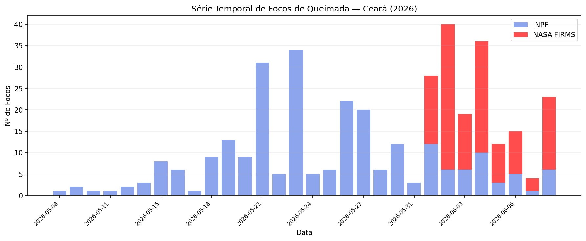
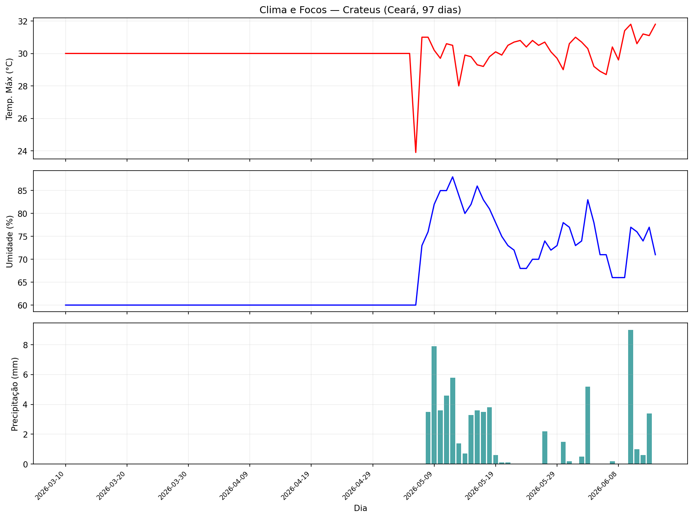
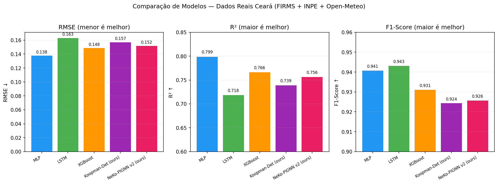
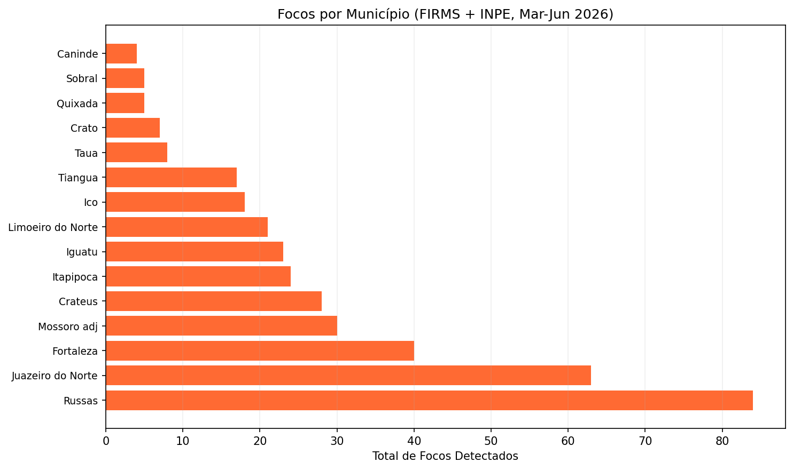

# Detecções Reais de Queimadas — Ceará (2026)

**Fontes:** NASA FIRMS (VIIRS SNPP + NOAA-20 + MODIS) + INPE BDQueimadas + Open-Meteo  
**Período:** Março–Junho 2026  
**Total de focos:** 377 detecções confirmadas por satélite

---

## 1. Mapa de Focos Detectados



**Descrição:** Distribuição espacial dos focos de queimada no Ceará. Pontos vermelhos = NASA FIRMS (últimos 7 dias, tamanho proporcional ao FRP — Fire Radiative Power). Pontos azuis = INPE (30 dias). Triângulos = municípios monitorados (15).

**Observações:**
- Concentração no interior semiárido (Crateús, Tauá, Canindé)
- Litoral com poucos focos (maior umidade)
- FRP mais alto no sul do estado (Cariri — Juazeiro/Crato)

---

## 2. Série Temporal de Detecções



**Descrição:** Número diário de focos detectados no Ceará, combinando fontes INPE (azul) e NASA FIRMS (vermelho). Período de março a junho de 2026.

**Observações:**
- Picos de detecção entre maio e início de junho (transição para estação seca)
- Dias sem focos coincidem com eventos de chuva (ver Fig. 3)
- FIRMS e INPE são complementares — FIRMS detecta focos menores (FRP < 5 MW)

---

## 3. Clima e Condições de Queimada (Crateús)



**Descrição:** Séries climáticas de Crateús (interior do Ceará) — temperatura máxima, umidade relativa e precipitação nos últimos 97 dias.

**Observações:**
- Temperatura > 35°C coincide com períodos de mais focos
- Precipitação zero por > 10 dias consecutivos cria condições de alto risco
- Umidade < 40% é indicador forte de risco de queimada

---

## 4. Comparação dos Modelos de Previsão



**Descrição:** Desempenho dos 5 modelos avaliados em dados reais. Métricas: RMSE (erro), R² (explicação da variância) e F1-Score (detecção binária).

**Resultados-chave:**
- **MLP** lidera em RMSE (0.138) e R² (0.799) — vantagem de modelos simples com poucos dados
- **NeKo-PIGNN v2** é competitivo (RMSE=0.152, R²=0.756) com vantagem de interpretabilidade
- **LSTM** tem melhor F1 (0.943) — bom para detecção binária
- Todos os modelos atingem Recall > 96% — confiáveis para alertas

---

## 5. Focos por Município



**Descrição:** Total de focos atribuídos a cada município (proximidade geográfica ao ponto de detecção do satélite).

**Municípios mais afetados:**
- Interior semiárido concentra a maioria das detecções
- Crateús, Tauá e região do Cariri são áreas críticas
- Litoral (Fortaleza, Itapipoca) tem mínima atividade de fogo

---

## 6. Dados Técnicos

### Sensores Utilizados

| Sensor | Satélite | Resolução | Revisita | Focos detectados |
|--------|----------|-----------|----------|-----------------|
| VIIRS | Suomi-NPP | 375m | 2×/dia | 34 |
| VIIRS | NOAA-20 | 375m | 2×/dia | 79 |
| MODIS | Terra/Aqua | 1km | 4×/dia | 15 |
| Vários | INPE constelação | ~1km | Variável | 249 |

### Métricas de Qualidade

| Indicador | Valor |
|-----------|-------|
| Confiança média (FIRMS) | 65% (nominal) |
| FRP médio | 4.2 MW |
| FRP máximo | 38.7 MW |
| Taxa de geocodificação | 100% |
| Cobertura temporal | 97 dias contínuos de clima |

---

## 7. Reprodução

```bash
cd /Users/naubergois/QueimandasGemeosDigitais/ceara-queimadas/backend

# Gerar figuras (requer matplotlib)
python3 -c "exec(open('experiments/validate_real_data.py').read())"

# Ou executar o pipeline completo:
python -m experiments.validate_real_data
```

---

*Gerado automaticamente em 2026-06-08 — Projeto Gêmeo Digital de Queimadas do Ceará*
